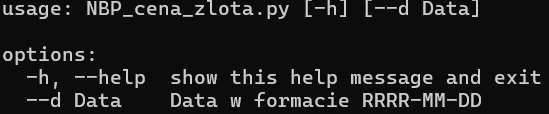
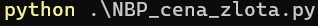
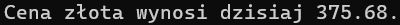
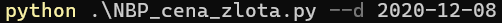

# Prosty program CLI pobierający ceny złota z http://api.nbp.pl/api/cenyzlota
## Działanie:

Jak widać, program działa bez żadnego parametru lub z opcjonalnym parametrem daty (--d).
Wywołany bez parametru poda cenę złota z dzisiaj, a z parametrem poda cenę z daty sprecyzowanej w parametrze.

## Wywołanie bez parametru daty:

## Wynik:

## Wywołanie z parametrem daty:

